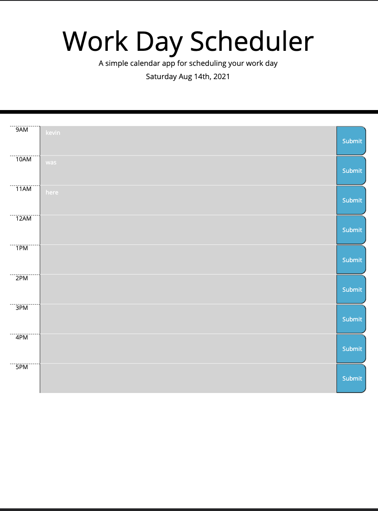

# Day Planner

A easy to use day planner for the 9 - 5 work day.

## How it works

This is a day planner for a 9-5 work day. When starting at 9am the first bar will appear red with all furture available time slots appearing green. As the day progresses the hours of the past will appear grey out and completed. To enter a task simply click on the text area and type in your plan. After you will hit the save button and it will save your plan in the local storage. If you close out of or refresh the page your plan will still remain. In order to delete a plan simply erase it and hit save again. 

### Built with

* Bootstrap
* Moment JS

## Help

When clicking the save button it will save all previous entered texts. This will allow you to enter multiple plans at once time and only click save once.

## Authors

Kevin LaCarrubba
